[](https://marketplace.visualstudio.com/items?itemName=nanoframework.vscode-nanoframework) [](https://dev.azure.com/nanoframework/VSCodeExtension/_build/latest?definitionId=86&branchName=develop) [](https://discord.gg/gCyBu8T)


-----

# .NET nanoFramework VS Code Extension

This extension allows you to use VS Code to flash, build and deploy your C# code for .NET nanoFramework on your device regardless of the platform you're using. This has been tested on Mac, Linux (64 bits) and Windows (64 bits).

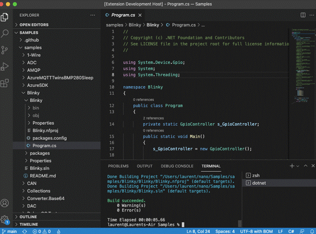

## Features

This .NET nanoFramework VS Code extension allow you to flash, build and deploy your C# .NET nanoFramework application on an ESP32 or STM32 MCU.

### Flashing the device

Select `nanoFramework: Flash device` and follow the steps.

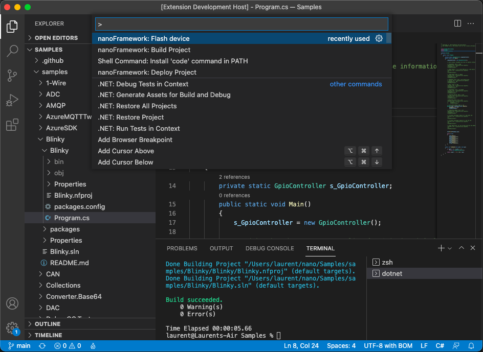

Based on the target you will select, the menus will automatically adjust to help you finding the correct version, DFU or Serial Port.

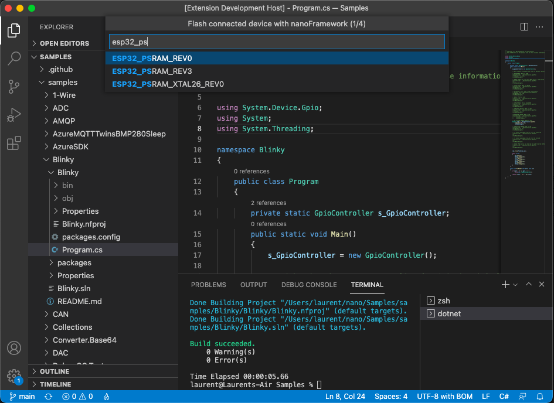

Once all options has been selected, you'll see the flashing happening:

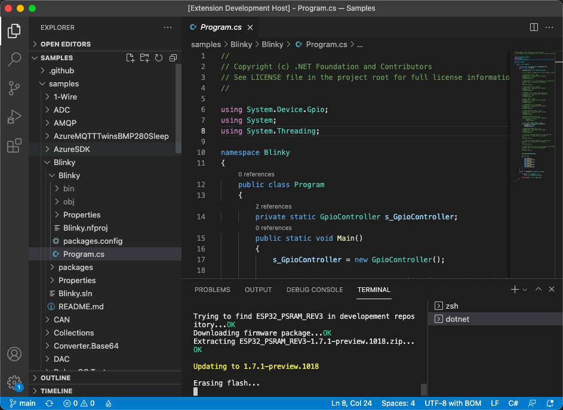

### Building your code

Select `nanoFramework: Build Project` and follow the steps.

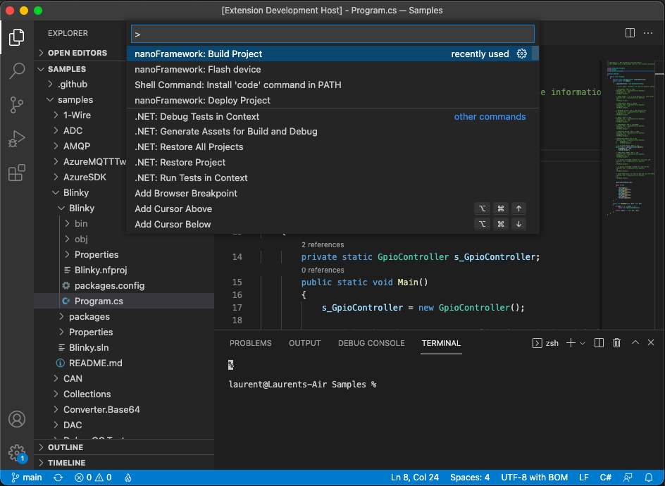

If you have multiple solutions in the open folder, you'll be able to select the one to build:

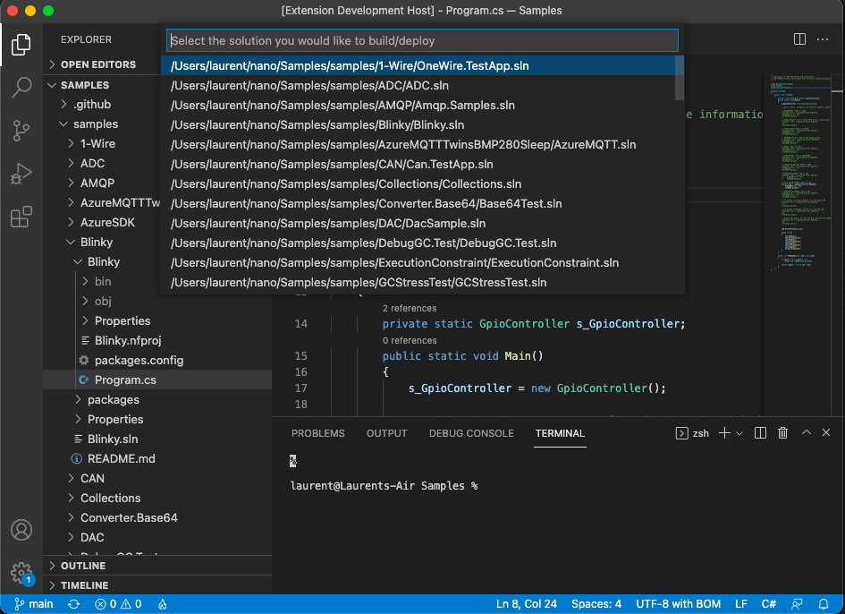

Build result will be display in the Terminal:

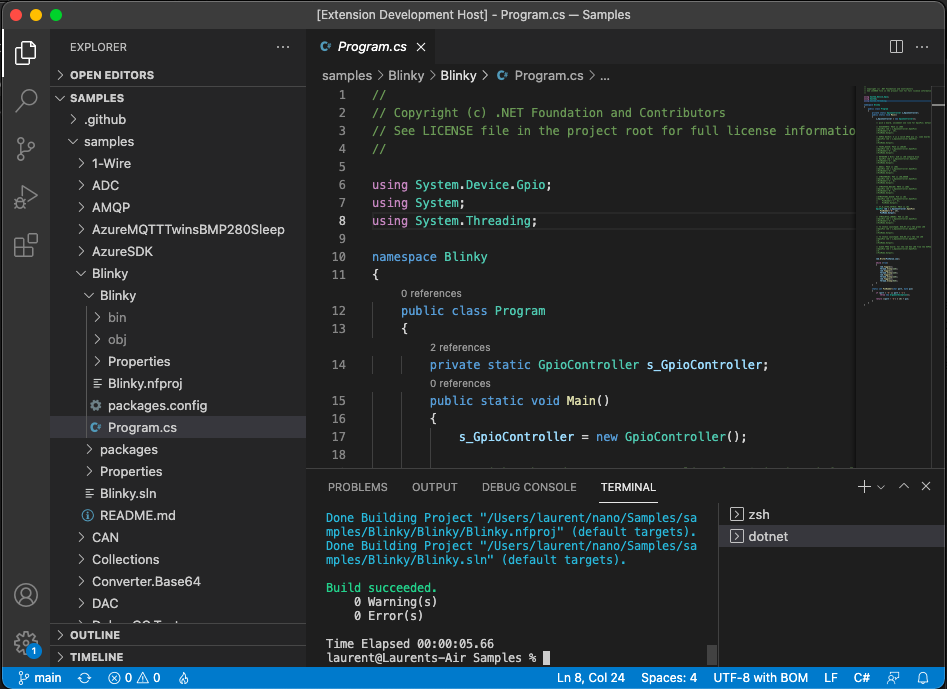

### Deploy to your device

Select `nanoFramework: Deploy Project` and follow the steps.

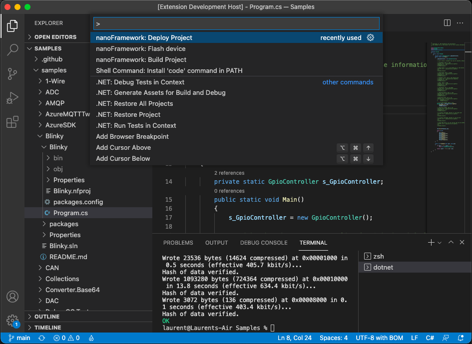

Similar as building the project, you'll have to select the project to deploy. The code will be built and the deployment will start:

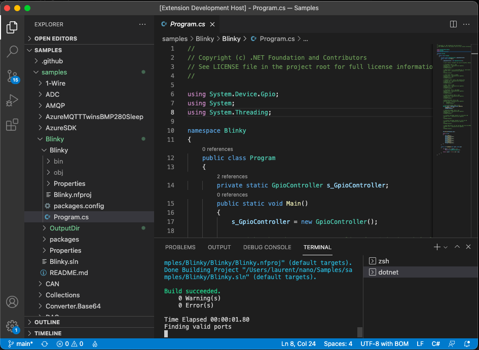

You'll get as well the status of the deployment happening in the Terminal.

### Create solutions and projects

To create a solution, you can select any folder on your workspace, right click and select the create solution option.

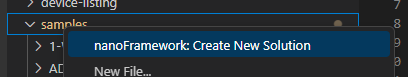

You then need to place a valid name and your solution is created.

On the solution, right click and select `Add project to existing Solution`

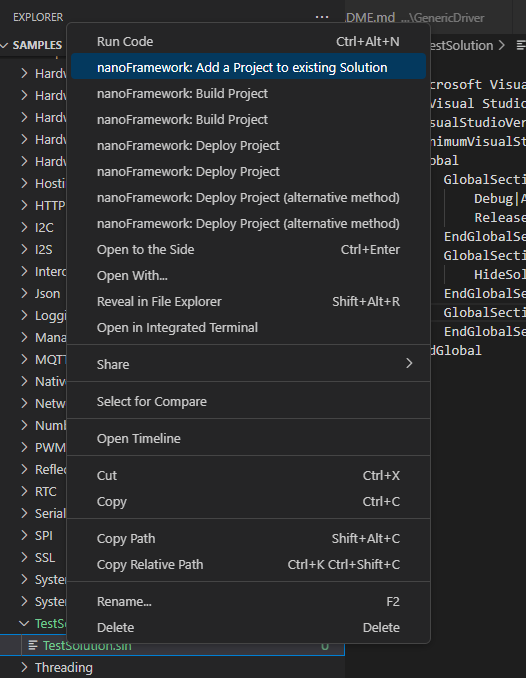

 Place a valid name like in this example `MyApplication`.

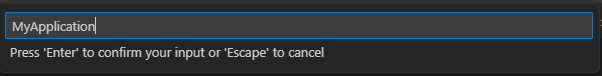

Then select the type of project you want to add.

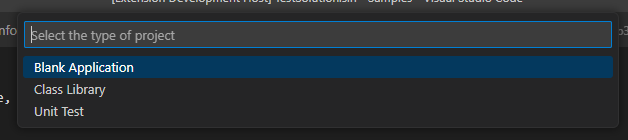

## Unit Testing

The extension integrates with the VS Code **Test Explorer** to discover, run, and report results for [nanoFramework.TestFramework](https://github.com/nanoframework/nanoFramework.TestFramework) tests.

### Test Runner Features

| Feature | Description |
| ------- | ----------- |
| **Automatic Discovery** | Detects `[TestClass]`, `[TestMethod]`, `[Setup]`, `[Cleanup]`, and `[DataRow]` attributes in `.nfproj` projects |
| **Emulator Execution** | Runs tests on the **nanoCLR** emulator — no hardware required |
| **Device Execution** | Deploys and runs tests on a physical nanoFramework device via serial/network |
| **DataRow Support** | Parameterised tests with `[DataRow(...)]` shown as individual items per data row |
| **CodeLens** | Inline "Run Test" / "Run Class" links above test methods and classes |
| **Watch Mode** | Automatically re-runs tests when source files are saved |
| **Tag Filtering** | Filter by test type: `@testMethod`, `@dataRow`, `@setup`, `@cleanup` |
| **runsettings** | Optional `nano.runsettings` for timeout and environment configuration |

### Running Tests

1. Open a workspace containing a `.nfproj` test project that references `nanoFramework.TestFramework`.
2. Open the **Testing** side bar (click the flask icon in the Activity Bar, or run `Testing: Focus on Test Explorer View` from the Command Palette).
3. Tests are discovered automatically. Click the **Run** button to execute on the nanoCLR emulator.
4. To run on a physical device, click the dropdown arrow next to Run and select **"Run on Device"**, then choose a serial port.

### Test Settings

Configure under `nanoFramework.test.*` in VS Code settings:

| Setting | Default | Description |
| ------- | ------- | ----------- |
| `sessionTimeout` | `120000` | Max time (ms) to wait for test output |
| `logging` | `None` | Logging level: `None`, `Normal`, `Verbose` |
| `nanoclrVersion` | `""` | Specific nanoCLR version (empty = latest stable) |
| `usePreviewClr` | `false` | Use preview nanoCLR builds |
| `pathToLocalCLRInstance` | `""` | Path to a local nanoCLR binary |
| `hardwarePort` | `""` | Pre-configured device port (e.g. `COM3`) |
| `hardwareRetries` | `3` | Connection retry count for hardware runs |
| `runSettingsPath` | `""` | Path to `nano.runsettings` file |
| `watchMode` | `false` | Auto-run tests on file save |

> **Note:** The nanoCLR emulator always runs _all_ tests in the assembly. When you select a single test, only that test's result is reported, but the full suite executes internally.

For detailed information, see the [Testing Guide](docs/testing.md).

## Debugging

The extension provides full debugging support for .NET nanoFramework applications running on connected devices.

### Quick Start

1. **Connect your device** - Ensure your nanoFramework device is connected via USB/Serial
2. **Build your project** - Use `nanoFramework: Build Project` command
3. **Start debugging** - Press `F5` or use `Run > Start Debugging`

### Debug Features

| Feature | Description |
| ------- | ----------- |
| **Breakpoints** | Set breakpoints by clicking in the gutter or pressing `F9` |
| **Step Through Code** | Step Over (`F10`) currently like Continue, Step Into (`F11`), Step Out (`Shift+F11`) |
| **Variable Inspection** | View local variables, arguments, and object properties |
| **Watch Expressions** | Add expressions to the Watch panel |
| **Call Stack** | View the current call stack with source locations |
| **Debug Console** | See `Debug.WriteLine` output and evaluate expressions |
| **Exception Handling** | Break on exceptions (configurable) |

### launch.json Configuration

Create a `.vscode/launch.json` file in your workspace with the following configurations:

```json
{
    "version": "0.2.0",
    "configurations": [
        {
            "name": "nanoFramework: Launch and Debug",
            "type": "nanoframework",
            "request": "launch",
            "program": "${workspaceFolder}/${workspaceFolderBasename}/bin/Debug",
            "device": "",
            "stopOnEntry": true,
            "deployAssemblies": true,
            "verbosity": "none"
        },
        {
            "name": "nanoFramework: Attach to Device",
            "type": "nanoframework",
            "request": "attach",
            "device": "",
            "program": "${workspaceFolder}/${workspaceFolderBasename}/bin/Debug"
        }
    ]
}
```

#### Configuration Options

| Option | Type | Description |
| ------ | ---- | ----------- |
| `type` | string | Must be `"nanoframework"` |
| `request` | string | `"launch"` to deploy and debug, `"attach"` to debug running code |
| `program` | string | Path to the `.pe` file or directory containing assemblies |
| `device` | string | COM port (e.g., `"COM3"`) or IP address. Leave empty for auto-detect |
| `stopOnEntry` | boolean | Pause at program entry point (default: `true`) |
| `deployAssemblies` | boolean | Deploy assemblies before debugging (launch only) |
| `verbosity` | string | Logging verbosity: `"none"`, `"information"` (default), or `"debug"` |

### Device Selection

- If `device` is empty, the extension will:
  - Use the last selected device if available
  - Auto-select if only one device is connected
  - Show a device picker if multiple devices are found

- Use the `nanoFramework: Select Debug Device` command to manually choose a device

### Troubleshooting

**Device not detected:**

- Ensure the device is properly connected and running nanoFramework firmware
- Check that the correct drivers are installed for your device
- Try unplugging and reconnecting the device

**Breakpoints not hitting:**

- Ensure you have build the project first!
- Ensure the deployed code matches your source files
- Adjust the path for `"program": "${workspaceFolder}/${workspaceFolderBasename}/bin/Debug"` if needed
- Rebuild the project before debugging
- Check that symbol files (.pdbx, .pdb) are present in the output directory

**Debug session won't start:**

- Verify .NET 10.0 runtime is installed
- Check the Debug Console for error messages
- Ensure no other application is using the COM port
- Change the log level to see more errors

## v2 Support (Generics)

The extension supports nanoFramework v2, which adds **generics** to the .NET nanoFramework runtime. Both v1 (stable) and v2 (preview) projects can be debugged and tested side by side.

### Automatic Detection

The extension automatically detects whether your project targets v1 or v2 by checking the `nanoFramework.CoreLibrary` package version in your `.nfproj` file:

- **CoreLibrary 1.x** → v1 (stable)
- **CoreLibrary 2.x** → v2 (generics/preview)

A status bar indicator shows the detected version when a nanoFramework workspace is open.

### What You Need for v2

1. **v2 firmware** on your device — flash with `nanoff --target <target> --preview`
2. **v2 NuGet packages** in your project (CoreLibrary 2.x, etc.)
3. For emulator tests: set `nanoFramework.test.usePreviewClr` to `true`

### Manual Override

Add `targetVersion` to your `launch.json` configuration:

```json
{
    "name": "Debug v2 Project",
    "type": "nanoframework",
    "request": "launch",
    "program": "${workspaceFolder}/bin/Debug",
    "targetVersion": "v2"
}
```

Or set `nanoFramework.targetVersion` to `"v1"` or `"v2"` in VS Code settings.

For detailed information, see the [Debugging Guide](docs/debugging.md).

## Requirements

You will need to make sure you'll have the following elements installed:

- [.NET 10.0](https://dotnet.microsoft.com/download/dotnet/10.0) or later
- [nanoff](https://github.com/nanoframework/nanoFirmwareFlasher) - Install via: `dotnet tool install -g nanoff`
- **Windows only:** [Visual Studio Build Tools](https://visualstudio.microsoft.com/downloads/#build-tools-for-visual-studio-2022) with ".NET desktop build tools" workload
- **Linux/macOS only:** [mono-complete](https://www.mono-project.com/docs/getting-started/install/) with msbuild, and [nuget CLI](https://www.nuget.org/downloads)

> **Note:** The `.slnx` solution format is fully supported on Windows. On Linux/macOS,  
> `.slnx` requires a recent Mono installation with an updated MSBuild. If your Mono  
> version does not support `.slnx`, use the classic `.sln` format instead.

### Linux-specific Requirements

On Linux, you may need to add your user to the `dialout` group to access serial ports:

```bash
sudo usermod -aG dialout $USER
```

Log out and back in for this to take effect.

> **Note:** Do not use the `mono-complete` package provided by your Linux distribution  
> as it may not include `msbuild` which is required for this extension to work.  
>
> Instead install the `mono-complete` package provided by the Mono Project.  
> The [preview](https://www.mono-project.com/download/preview/) version is recommended.

**Debugging is now supported!** See the [Debugging](#debugging) section below.

This extension works on:

- **Windows**: x64 and ARM64
- **macOS**: x64 (Intel) and ARM64 (Apple Silicon M1/M2/M3)
- **Linux**: x64 and ARM64

32-bit operating systems are not supported.

## Known Issues

Step over in debug mode is like continue so far. We're activey working on improving this. You can setup as many break points as you want, so, if you need an equivalent of setp over, you can do this!

The new `.slnx` solution format is supported on Windows (Visual Studio Build Tools with MSBuild 17.12+). On Linux and macOS, `.slnx` support requires a recent Mono installation that includes an updated MSBuild. If your Mono version does not support `.slnx`, use the classic `.sln` format instead.

## Developing for the VS Code extension

Documentation about development for the extension can be found [here](installation.md).

## Feedback and documentation

For documentation, providing feedback, issues and finding out how to contribute please refer to the [Home repo](https://github.com/nanoframework/Home).

Join our Discord community [here](https://discord.gg/gCyBu8T).

## Credits

The list of contributors to this project can be found at [CONTRIBUTORS](https://github.com/nanoframework/Home/blob/main/CONTRIBUTORS.md).

## License

The **nanoFramework** Class Libraries are licensed under the [MIT license](LICENSE.md).

## Code of Conduct

This project has adopted the code of conduct defined by the Contributor Covenant to clarify expected behaviour in our community.
For more information see the [.NET Foundation Code of Conduct](https://dotnetfoundation.org/code-of-conduct).

### .NET Foundation

This project is supported by the [.NET Foundation](https://dotnetfoundation.org).
