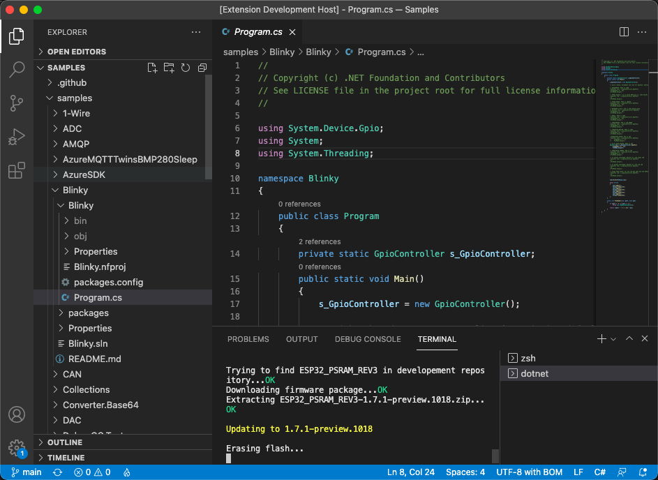

  

-----

# .NET nanoFramework VS Code Extension

This extension allows you to use VS Code to flash, build and deploy your C# code for .NET nanoFramework on your device regardless of the platform you're using. This has been tested on Mac, Linux (64 bits) and Windows (64 bits).

## Features

This .NET nanoFramework VS Code extension allow you to flash, build and deploy your C# .NET nanoFramework application on an ESP32 or STM32 MCU.

### Flashing the device

Select `nanoFramework: Flash device` and follow the steps.

Based on the target you will select, the menus will automatically adjust to help you finding the correct version, DFU or Serial Port.

Once all options has been selected, you'll see the flashing happening:

### Building your code

Select `nanoFramework: Build Project` and follow the steps.

If you have multiple solutions in the open folder, you'll be able to select the one to build:

Build result will be display in the Terminal:

### Deploy to your device

Select `nanoFramework: Build Project` and follow the steps.

Similar as building the project, you'll have to select the project to deploy. The code will be built and the deployment will start:

You'll get as well the status of the deployment happening in the Terminal.

## Requirements

You will need to make sure you'll have the following elements installed:

- [.NET 5.0 or greater](https://dotnet.microsoft.com/download/dotnet)
- [Visual Studio build tools](https://visualstudio.microsoft.com/en/thank-you-downloading-visual-studio/?sku=BuildTools&rel=16) on Windows, `mono-complete` on [Linux/macOS](https://www.mono-project.com/docs/getting-started/install/)

## Known Issues

This extension will **not** allow you to debug the device. Debug is only available on Windows with [Visual Studio](https://visualstudio.microsoft.com/downloads/) (any edition) and the [.NET nanoFramework Extension](https://marketplace.visualstudio.com/items?itemName=nanoframework.nanoFramework-VS2022-Extension) installed.

This extension will work on any Mac version (x64 or M1), works only on Linux x64 and Windows x64. Other 32 bits OS or ARM platforms are not supported.

## Release Notes

### 1.0.0

Initial version.
